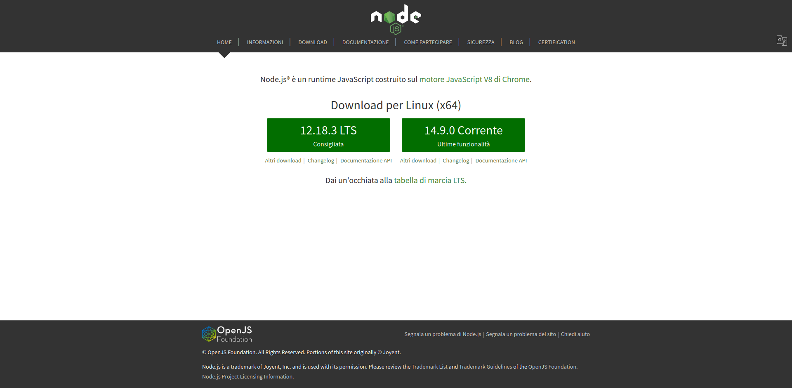
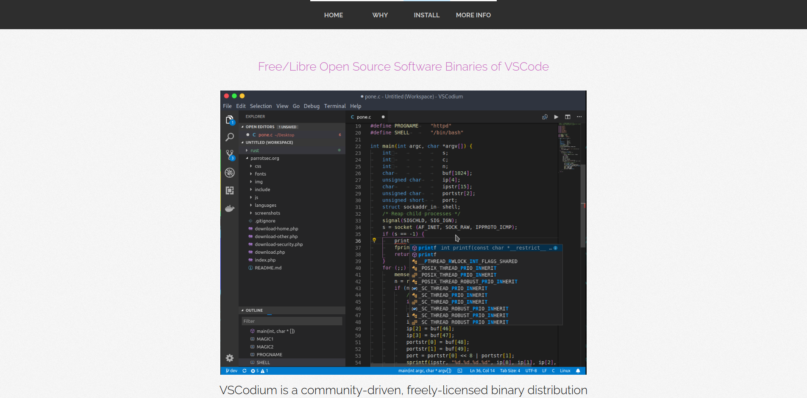
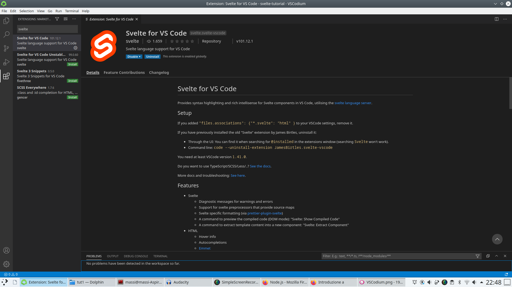

= MiniCorso SVELTE: Introduzione
:author: Gionata Massi
:date: 2020-09-03
:revnum: 1
:icons: font
:revealjs_theme: league
//:revealjs_autoSlide: 5000
:revealjs_history: true
:revealjs_fragmentInURL: true
:revealjs_viewDistance: 5
:revealjs_width: 1408
:revealjs_height: 792
:revealjs_controls: true
:revealjs_controlsLayout: edges
:revealjs_controlsTutorial: true
:revealjs_slideNumber: c/t
:revealjs_showSlideNumber: speaker
:revealjs_autoPlayMedia: true
:revealjs_defaultTiming: 42
//:revealjs_transitionSpeed: fast
//:revealjs_parallaxBackgroundImage: images/background-landscape-light-orange.jpg
//:revealjs_parallaxBackgroundSize: 4936px 2092px
//:customcss: css/presentation.css
//:imagesdir: images
:source-highlighter: highlightjs
//:highlightjs-theme: css/atom-one-light.css
// we want local served font-awesome fonts
//:iconfont-remote!:
//:iconfont-name: fonts/fontawesome/css/all

== Crediti

* Ispirato da https://www.youtube.com/playlist?list=PL4cUxeGkcC9hlbrVO_2QFVqVPhlZmz7tO[Svelte Tutorial for Beginners]

[.notes]
--
Benvenuti al primo video del tutorial sulla realizzazione di pagine web reattive con SVELTE.
Questo video è ispirato dal corso __Svelte Tutorial for Beginners__ che spiega diffusamente questa tecnologia per lo sviluppo di interfacce e applicazioni web.
--

== SVELTE

* È un compilatore che genera interfacce e applicazioni web *reattive*
* Permette di realizzare piccole parti di una pagina web o interi siti web (SPA)
* È integrato con un _framework_ per produrre web app complesse
* Può essere impiegato per creare app per cellulari

[.notes]
--
Cos'è SVELTE?
SVELTE è un compilatore che genera componenti o applicazioni web reattive, ossia in grado di cambiare il contenuto e la forma di presentazione in base ad una modifica dei dati, generata da un qualche evento.
Con SVELTE possiamo creare solo piccole parti di una pagina web, creando dei componenti riutilizzabili, ovvero possiamo creare intere applicazioni web, dette __Single Page Application__, _SPA_ in breve.
Essendo un compilatore, produce un codice che sarà interpretato dal browser senza portarsi dietro altre dipendenze, ossia definizioni di procedure, che non sono necessarie.
Questo ed altri dettagli di progettazione fanno sì che l'applicazione web risultante sia particolarmente efficiente.
--

== Differenze con altri framework "reattivi"

* Svelte è un compilatore, non un _framework_!
* Svelte compila il codice in un singolo file _JavaScript_
* Non incorpora altri _script_ o _librerie_
* Spesso un sito web realizzato con SVELTE risponde più velocemente di uno realizzato con framework analoghi

[.notes]
--
Le stesse applicazioni che possiamo realizzare con SVELTE potrebbero essere realizzate con Angular, React o Vue, che sono _framework_ per la realizzazione di applicazioni web reattive.
La principale differenza è nel fatto che Svelte è un compilatore e non un _framework_!
Produce un singolo file _JavaScript_ così che il browser non deve  richiede anche i vari script utilizzati dai vari framework, che rallentano il caricamento delle pagine. A differenza dei framwork citati, non utilizza delle tecniche di "Virtual DOM" per gestire il "rendering", ossia la restituzione grafica della pagina web, ma una modifica diretta del DOM mirata. In tal modo un sito web realizzato con SVELTE, frequentemente, risponde più velocemente di uno realizzato con framework analoghi.
Il fatto che il browser debba scaricare una minor quantità di dati e debba elaborare dei programmi più efficienti lo rende particolarmente adatto per produrre contenuti adatti ai dispositivi mobili.
--

== Prerequisiti

* HTML
* CSS
* JavaScript
* Aver installato Node.js (versione non inferiore alla 8)

[.notes]
--
Per usare SVELTE è necessario conoscere i tre linguaggi su cui è costruita la sintassi di un componente SVELTE: HTML, CSS e JavaScript.
Se mancano queste conoscenze, è bene tornare a studiarle prima di proseguire.
Lo sviluppo di un'applicazione e la sua pubblicazione possono essere gestite usando Node.js versione 8 o successiva.
Node un interprete JavaScript e basta averlo installato.

--

== Strumenti software

* Node.js
* VSCodium

[.notes]
--
Gli strumenti software necessari sono Node.js e un ambiente per la scrittura del codice.
--

=== Node.js

[.notes]
--
Node.js può essere installato scaricandolo dal sito, premendo il bottone d'installazione e seguendo la procedura.
--

=== VSCodium

=== VSCodium Extensions

[.notes]
--
Come editor di testo consiglio VSCodium, al quale aggiungere l'estensione "Svelte".
Codium può essere installato seguendo le indicazioni nel sito web.
Una volta avviata basta cercare l'estensione "svelte" ed installarla.
Un modo è premere Ctrl+P ed digitare `ext install svelte.svelte-vscode` seguito da invio. 
--

== Compiti

* Controllare il possesso dei prerequisiti di conoscenza
* Installare Node.js
* Installare VSCodium
* Installare l'estensione `svelte.svelte-vscode` di VSCodium

=== HTML

* Concetti
** Elemento, nome del __tag__, attributo
** Document Object Model (DOM)
* Tag comuni e loro annidamento
* Elementi di blocco e di linea

=== CSS

* Concetti
** Selettore, dichiarazione: proprietà e valori
** Selettori semplici: pre nome del tag, per id, per classe

=== JavaScript

* Sintassi di base

== Riferimenti

* https://www.youtube.com/playlist?list=PL4cUxeGkcC9hlbrVO_2QFVqVPhlZmz7tO[Svelte Tutorial for Beginners]
* https://svelte.dev/[Svelte]
* https://nodejs.org/it/[Node.js]
* https://vscodium.com/[VSCodium ]
* https://marketplace.visualstudio.com/items?itemName=svelte.svelte-vscode[Svelte for VS Code]

////
== Progetto

* Un _portfolio_
////

[.notes]
--
* tell anecdote
* make a point
--
